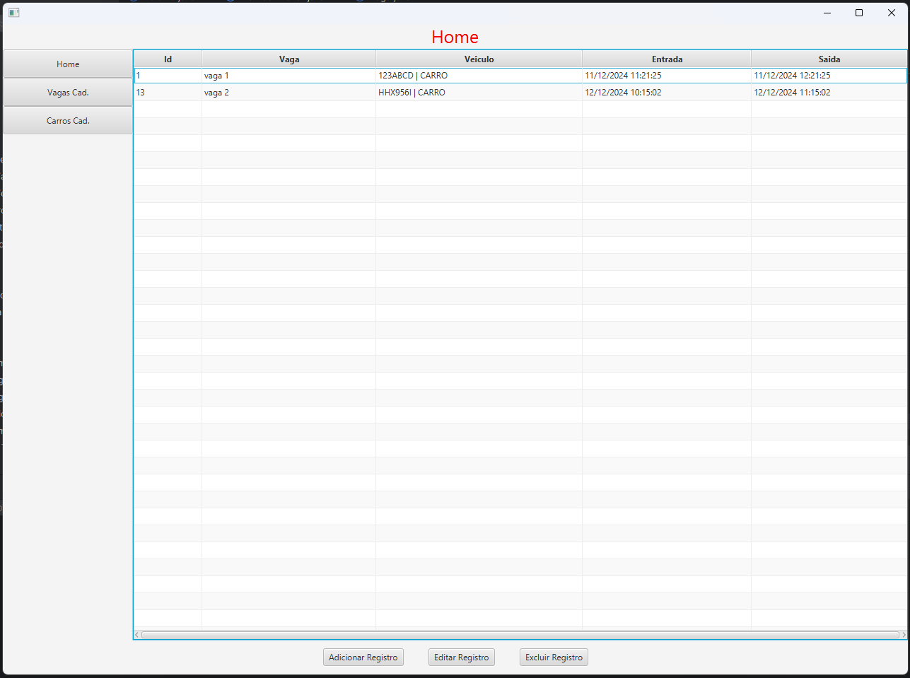
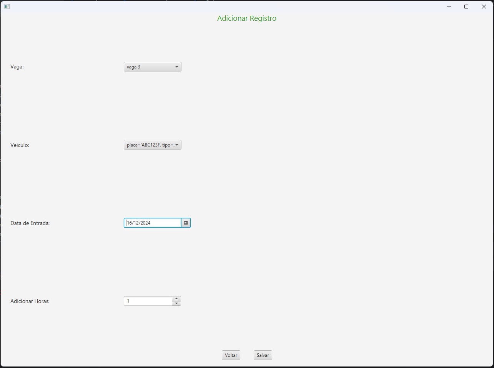
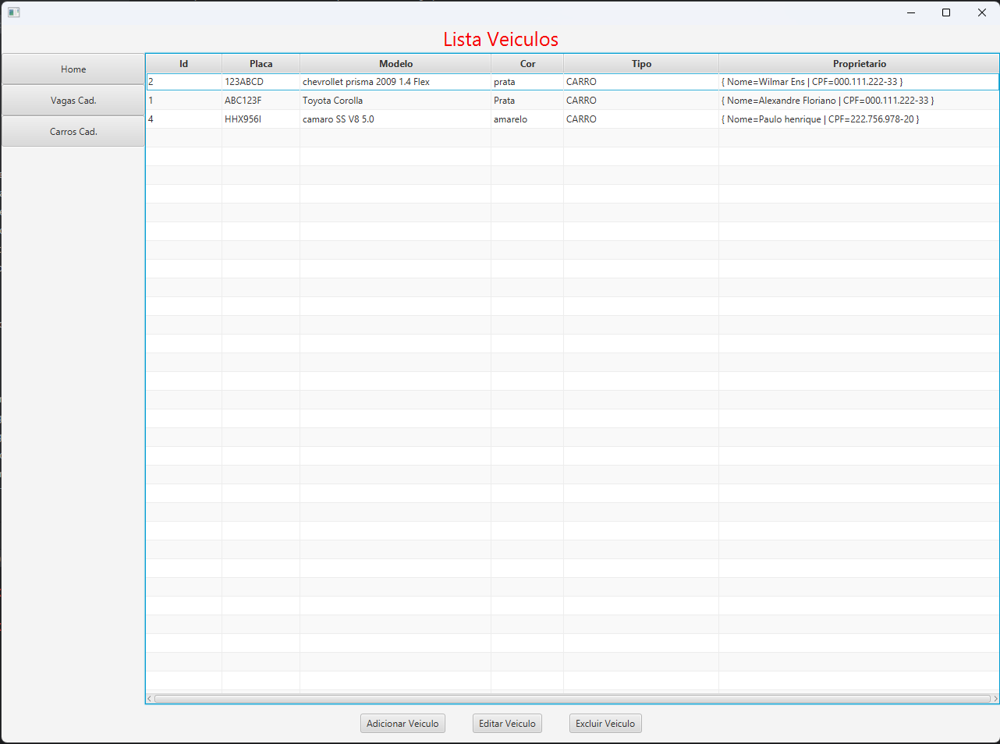

# Gerenciador de Estacionamento
#### Nomes: _Rafael Lopes & [Pedro Henrique](https://github.com/pedrosantos20)_
Para o nosso projeto da disciplina de `POO II`, decidimos elaborar um sistema de gerênciamento para pequenos estacionametos. A ideia do projeto é de que o sistema ajude a manter a organização do espaço, registrando os veículos presentes no local e seus respectivos donos.

## Dados
Pensando no que o sistema de propõe, ser simples, optamos por salvar os seguintes dados:
| Veiculo | Registro | Vagas | 
|-------|--------|--------|
| Placa | ID | ID | 
| Modelo | Data_entrada | Status | 
| Cor | Data_saida |  | 
| Tipo (carro, moto, caminhão) || | 
| Proprietário || |

## Modelo Relacional

***

